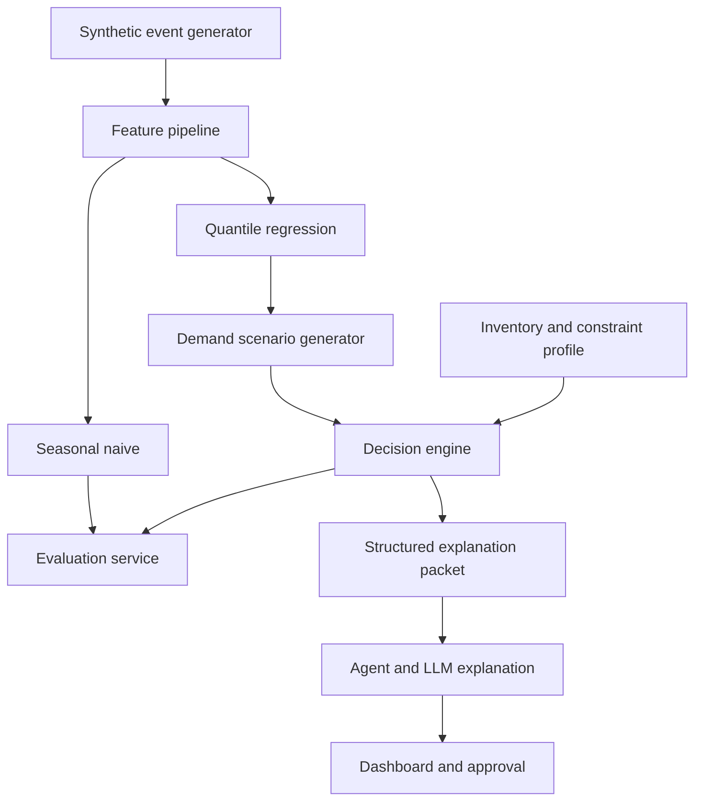

# Product Requirements Document VIRALCAST

**Versi:** 1.0  
**Status:** Ready for MVP implementation  
**Tim:** BuffTechBros  
**Challenge:** Demand Forecasting untuk Manufaktur dan Ritel  
**MVP window:** 24 jam hackathon

## 1. Ringkasan produk

VIRALCAST adalah asisten keputusan produksi dan replenishment untuk manufaktur serta retailer yang mengalami lonjakan permintaan dari social commerce. Sistem memperkirakan distribusi demand per SKU, menilai apakah lonjakan masih berlangsung ketika stok tambahan tersedia, kemudian membandingkan pilihan berkomitmen sekarang, bertahap, atau menunggu sampai commitment deadline.

Regression model dan decision engine menghasilkan angka. Agent mengatur alur analisis, memeriksa kelengkapan data, menjalankan tool, dan meminta persetujuan pengguna. LLM hanya menjelaskan insight, trade-off, asumsi, dan rekomendasi dari output yang terstruktur. MVP menggunakan data sintetis yang dapat direproduksi dan tidak melakukan transaksi otomatis.

## 2. Problem statement

Konten affiliate dapat menaikkan order sebuah produk dalam waktu singkat. Manufaktur dan retailer harus merespons sebelum tenggat produksi, pembelian bahan, atau pemesanan supplier, tetapi belum mengetahui apakah lonjakan akan bertahan sampai stok tambahan tersedia. Komitmen terlalu kecil menimbulkan lost sales, sedangkan komitmen terlalu besar mengikat modal dan meningkatkan risiko sisa stok, markdown, atau kedaluwarsa.

Forecast historis biasa kurang memadai karena:

- lonjakan tidak selalu mengikuti pola musiman;
- penjualan saat stockout lebih rendah daripada latent demand;
- data konten dapat memberi early signal tetapi tidak selalu berkonversi;
- keputusan dibatasi modal, kapasitas, lead time, minimum order, dan constraint kategori;
- menunggu memberi informasi lebih baik tetapi memiliki opportunity cost dan risiko melewati commitment deadline.

## 3. Product thesis

Jika manufaktur atau retailer memperoleh forecast probabilistik yang mempertimbangkan sinyal transaksi dan affiliate, lalu alternatif produksi atau replenishment dihitung dengan constraint operasional yang nyata, pengguna dapat mengambil keputusan yang lebih baik daripada menggunakan moving average atau intuisi saja.

Pembeda yang akan dibuktikan:

> VIRALCAST menghitung nilai menunggu informasi tambahan sebelum commitment deadline, lalu memilih jumlah produksi atau replenishment di bawah batas modal, kapasitas, dan lead time.

## 4. Goals

### 4.1 Goals MVP

1. Menghasilkan forecast numerik per SKU untuk 24, 48, dan 72 jam.
2. Menampilkan median dan interval prediksi.
3. Membandingkan seasonal naive, model transaksi, dan model transaksi plus konten.
4. Menghasilkan skenario lintasan demand yang dapat bertahan atau mereda.
5. Membandingkan keputusan berkomitmen sekarang, bertahap, atau menunggu.
6. Memenuhi constraint umum dan constraint profile kategori.
7. Menjelaskan rekomendasi dengan angka yang dapat ditelusuri.
8. Menjalankan tiga skenario demo end-to-end tanpa angka rekomendasi yang di-hard-code.

### 4.2 Non-goals MVP

- integrasi langsung dengan TikTok Shop Partner API;
- scraping data TikTok;
- perubahan COD atau komisi affiliate otomatis;
- fraud detection atau profiling pembeli;
- multi-marketplace dan multi-location;
- procurement atau purchase order otomatis;
- implementasi penuh seluruh kategori produk dalam MVP;
- eksekusi purchase order tanpa persetujuan;
- klaim peningkatan bisnis pada toko nyata.

## 5. Target user

### 5.1 Primary persona

Bu Rina mengelola operasi sebuah brand consumer goods dengan tiga SKU. Ia harus menentukan produksi atau replenishment sebelum commitment deadline, sementara affiliate dapat memicu lonjakan order yang sulit diprediksi. Ia membutuhkan rekomendasi yang menjelaskan kuantitas, modal, lost sales, sisa stok, dan waktu evaluasi ulang.

Makanan kemasan dipilih sebagai beachhead use case untuk demonstrasi, bukan sebagai batas vertikal produk. Arsitektur menggunakan `operation_mode` dan `constraint_profile` agar dapat diperluas ke fashion, beauty, elektronik, merchandise, dan produk rumah tangga. MVP hanya mengimplementasikan satu profil demo agar scope 24 jam tetap realistis.

### 5.2 Jobs to be done

- Ketika order mulai naik, saya ingin mengetahui apakah demand kemungkinan bertahan sampai stok tambahan tersedia.
- Sebelum commitment deadline, saya ingin membandingkan risiko bertindak sekarang dengan menunggu data tambahan.
- Ketika kapasitas terbatas, saya ingin mengetahui SKU mana yang sebaiknya diprioritaskan.
- Saya ingin memahami modal, expected contribution, lost sales, dan residual-stock risk dari setiap pilihan.

## 6. Key concepts

### 6.1 Dua dimensi lonjakan

VIRALCAST tidak menggunakan satu classifier dengan kelas ramai sesaat, ramai beneran, dan ramai palsu. Sistem memisahkan:

1. **Surge persistence:** peluang demand tetap berada di atas baseline pada 24 dan 48 jam berikutnya.
2. **Transaction risk:** peluang order batal sebelum dikirim, gagal kirim, atau retur.

UI dapat menerjemahkannya menjadi label sementara, berkelanjutan, atau berisiko tinggi, tetapi perhitungan menggunakan probabilitas asli.

### 6.2 Tiga besaran demand

- `latent_demand`: demand yang sebenarnya terjadi di simulator dan hanya diketahui evaluator.
- `fulfillment_demand`: unit yang diperkirakan perlu disiapkan dan dikirim.
- `successful_sales`: unit yang diperkirakan selesai diterima dan menghasilkan pendapatan.

Retur dan gagal kirim memengaruhi expected contribution, bukan langsung mengurangi kebutuhan fulfillment.

### 6.3 Operation mode dan constraint profile

| Kategori | Operation mode | Constraint utama |
| --- | --- | --- |
| Makanan kemasan | Production | Kapasitas, bahan, batch, dan masa simpan |
| Fashion | Replenishment | Varian, supplier MOQ, dan lead time |
| Beauty | Production atau replenishment | Batch, expiry, dan compliance |
| Elektronik | Replenishment | Modal, supplier MOQ, dan lead time |

Core forecast tetap sama untuk seluruh kategori. Perbedaannya ditangani oleh konfigurasi decision engine, bukan dengan membuat model LLM berbeda untuk setiap kategori.

## 7. User journey

1. Pengguna membuka dashboard, memilih SKU, operation mode, dan constraint profile.
2. Sistem menampilkan actual order, baseline, forecast, dan interval.
3. Agent mendeteksi kenaikan, stockout, data hilang, atau perubahan deadline.
4. Forecast tool menghasilkan distribusi demand.
5. Scenario generator membentuk lintasan demand.
6. Decision engine menghitung tiga alternatif tindakan.
7. Dashboard menampilkan rekomendasi, alasan, kebutuhan modal, dan risiko.
8. LLM menyusun penjelasan dari forecast summary dan action comparison yang tervalidasi.
9. Pengguna mengubah kapasitas, lead time, deadline, atau modal jika ingin melakukan what-if analysis.
10. Sistem menghitung ulang rekomendasi.
11. Pengguna menyetujui draf rencana produksi atau replenishment. MVP tidak mengeksekusi pembelian.

## 8. Functional requirements

### 8.1 Data and simulation

| ID | Requirement | Priority |
| --- | --- | --- |
| FR-D01 | Sistem menyediakan simulator data per jam dengan seed yang dapat ditentukan. | P0 |
| FR-D02 | Simulator menghasilkan latent demand, observed orders, stock-constrained sales, content signal, dan fulfillment outcome secara terpisah. | P0 |
| FR-D03 | Simulator menyediakan minimal tiga SKU dan 90 hari data historis. | P0 |
| FR-D04 | Simulator menyediakan episode true surge, fading surge, false content signal, missing signal, stockout, dan capacity conflict. | P0 |
| FR-D05 | Train, validation, dan test dipisahkan berdasarkan waktu serta event seed. | P0 |
| FR-D06 | Sistem dapat berjalan ketika seluruh fitur konten bernilai null. | P0 |
| FR-D07 | Dataset menyimpan operation mode dan constraint profile secara eksplisit. | P0 |

### 8.2 Forecasting

| ID | Requirement | Priority |
| --- | --- | --- |
| FR-F01 | Sistem menghitung seasonal naive sebagai baseline. | P0 |
| FR-F02 | Sistem melatih regression model transaksi menggunakan lag, rolling features, harga, kalender, promosi, dan stockout flag. | P0 |
| FR-F03 | Sistem melatih enriched regression dengan fitur affiliate dan content signal yang tersedia. | P0 |
| FR-F04 | Quantile regression menghasilkan cumulative-demand P10, P50, dan P90 untuk horizon 24, 48, dan 72 jam. | P0 |
| FR-F05 | Sistem menghitung surge persistence probability dari skenario demand. | P0 |
| FR-F06 | Sistem menghitung transaction risk secara terpisah dari surge persistence. | P1 |
| FR-F07 | Sistem menampilkan confidence lebih rendah ketika fitur penting hilang atau SKU baru. | P1 |

### 8.3 Decision engine

| ID | Requirement | Priority |
| --- | --- | --- |
| FR-O01 | Sistem menghitung kandidat komitmen sekarang, bertahap, dan menunggu. | P0 |
| FR-O02 | Setiap kandidat diuji pada demand scenarios yang sama. | P0 |
| FR-O03 | Sistem mematuhi constraint umum dan constraint profile kategori. | P0 |
| FR-O04 | Sistem menghitung expected contribution, fill rate, lost sales, ending inventory, dan residual-stock risk. | P0 |
| FR-O05 | Opsi menunggu memasukkan lost sales dan risiko melewati deadline. | P0 |
| FR-O06 | Perubahan kapasitas, modal, atau deadline memicu recomputation. | P0 |
| FR-O07 | Sistem mengoptimalkan alokasi kapasitas lintas SKU. | P1 |

### 8.4 Agent and explanation

| ID | Requirement | Priority |
| --- | --- | --- |
| FR-A01 | Agent memeriksa freshness, missing data, dan stockout censoring sebelum forecasting. | P0 |
| FR-A02 | Agent hanya menggunakan angka dari tool output. | P0 |
| FR-A03 | Agent menyajikan rekomendasi dan minimal dua alternatif. | P0 |
| FR-A04 | LLM menjelaskan faktor utama dan asumsi hanya dari explanation packet yang tervalidasi. | P0 |
| FR-A05 | Agent meminta human approval sebelum membuat draf rencana produksi atau replenishment. | P0 |
| FR-A06 | Semua tool input, output, timestamp, dan model version dicatat. | P1 |
| FR-A07 | LLM tidak boleh menghitung ulang forecast, mengubah rekomendasi, atau membuat angka baru. | P0 |

### 8.5 Dashboard

| ID | Requirement | Priority |
| --- | --- | --- |
| FR-U01 | Dashboard menampilkan actual, baseline, forecast median, dan interval. | P0 |
| FR-U02 | Dashboard menampilkan stok, projected stockout, dan commitment deadline. | P0 |
| FR-U03 | Dashboard menampilkan tiga kartu alternatif keputusan. | P0 |
| FR-U04 | Setiap kartu menampilkan kuantitas, modal, expected contribution, lost sales, dan residual-stock risk. | P0 |
| FR-U05 | Pengguna dapat mengubah modal, kapasitas, lead time, dan deadline. | P0 |
| FR-U06 | Dashboard menampilkan label Synthetic Demo Data. | P0 |
| FR-U07 | Dashboard mempunyai fallback state ketika data konten hilang. | P0 |

## 9. Data model

### 9.1 Hourly SKU observation

```text
timestamp
shop_id
sku_id
product_category
orders_created
orders_cancelled_pre_ship
orders_shipped
orders_delivered
orders_returned
stock_on_hand
incoming_stock
stockout_flag
price
promotion_flag
product_views nullable
affiliate_orders nullable
active_affiliates nullable
content_view_velocity nullable
```

### 9.2 Decision configuration

```text
operation_mode                   PRODUCTION | REPLENISHMENT
constraint_profile              FOOD_DEMO | FASHION | BEAUTY | ELECTRONICS
sku_id
unit_selling_price
unit_variable_cost
production_minutes_per_unit      nullable
material_per_unit                nullable
supplier_lead_time_hours         nullable
minimum_commitment
shelf_life_hours                 nullable
salvage_value_per_unit

shop_id
daily_capacity_minutes
raw_material_stock               nullable
packaging_stock                  nullable
working_capital_limit
commitment_deadline
```

Field yang tidak relevan untuk sebuah kategori bernilai `null` dan tidak dijadikan constraint. MVP menggunakan `operation_mode=PRODUCTION` dan `constraint_profile=FOOD_DEMO`; schema yang sama dapat memakai `REPLENISHMENT` serta supplier lead time untuk kategori lain.

### 9.3 Decision output

```json
{
  "decision_time": "2026-09-17T13:00:00+07:00",
  "sku_id": "SKU-001",
  "operation_mode": "PRODUCTION",
  "constraint_profile": "FOOD_DEMO",
  "recommended_action": "STAGED_COMMITMENT",
  "commit_now_units": 20,
  "commit_later_units": 15,
  "reevaluate_at": "2026-09-17T15:00:00+07:00",
  "required_capital": 420000,
  "expected_contribution": 285000,
  "expected_fill_rate": 0.91,
  "expected_lost_units": 6,
  "residual_stock_risk_units": 3,
  "surge_persistence_48h": 0.72,
  "confidence": "MEDIUM",
  "assumptions": []
}
```

### 9.4 Forecast output

```json
{
  "forecast_cutoff": "2026-09-17T13:00:00+07:00",
  "sku_id": "SKU-001",
  "horizon_hours": 48,
  "target": "cumulative_fulfillment_demand",
  "p10": 31,
  "p50": 44,
  "p90": 63,
  "surge_persistence_probability": 0.72,
  "content_features_used": true,
  "data_quality_flags": [],
  "model_name": "lightgbm_quantile",
  "model_version": "forecast-v1"
}
```

### 9.5 LLM explanation packet

LLM tidak menerima satu angka prediksi tanpa konteks. Agent mengirim paket terstruktur yang berisi:

- forecast P10, P50, P90 dan surge persistence;
- rekomendasi decision engine dan minimal dua alternatif;
- expected contribution, fill rate, lost sales, serta residual-stock risk;
- constraint aktif, asumsi, data-quality flags, model version, dan reevaluation trigger.

LLM boleh merangkum insight dan trade-off, tetapi tidak boleh menghitung ulang forecast, memilih tindakan lain, atau menambahkan angka yang tidak ada dalam paket.

## 10. Model requirements

### 10.1 Baseline

Seasonal naive menggunakan nilai pada jam atau hari musiman sebelumnya. Moving average dapat ditampilkan sebagai baseline tambahan. Prophet bukan dependency wajib.

### 10.2 Synthetic dataset generation

Dataset hackathon berisi tiga sampai lima SKU, frekuensi per jam, dan minimal 90 hari histori. Generator membangun data melalui urutan berikut:

1. Buat latent demand dari level dasar, seasonality jam/hari, tren, harga, dan promosi.
2. Tambahkan event social-commerce dengan `event_start`, `content_velocity`, conversion lag, peak multiplier, dan decay rate.
3. Terapkan inventory constraint sehingga observed sales dapat lebih kecil dari latent demand saat stockout.
4. Simulasikan cancel-before-ship, failed delivery, serta return secara terpisah.
5. Sisipkan missing content signal dan false viral spike untuk menguji fallback.
6. Simpan event seed agar skenario dapat direproduksi dan unseen seeds dapat dipakai sebagai test set.

Target training utama bukan order pada baris yang sama, melainkan cumulative fulfillment demand setelah forecast cutoff:

- `target_demand_24h`;
- `target_demand_48h`;
- `target_demand_72h`.

`latent_demand` disimpan pada tabel evaluator dan tidak pernah menjadi feature. Label training menggunakan future fulfillment demand pada window yang tidak tersensor; window yang melewati stockout ditandai, dikeluarkan, atau diberi perlakuan khusus agar model tidak belajar bahwa stok kosong berarti demand nol.

### 10.3 Main regression forecast

Model yang disarankan adalah LightGBM atau XGBoost quantile regression. Untuk MVP, gunakan pooled model lintas SKU, lalu latih model terpisah per horizon dan kuantil agar implementasi sederhana dan output ketidakpastian eksplisit. Identitas SKU dan kategori menjadi feature, bukan alasan membuat model kecil terpisah untuk setiap SKU. Fitur minimum:

- lag demand dan order;
- rolling mean, standard deviation, dan growth;
- harga serta promosi;
- jam, hari, dan event yang sudah diketahui;
- stockout flag;
- product views, affiliate orders, active affiliates, dan content velocity jika tersedia.

Kuantil per jam tidak langsung dianggap sebagai trajectory. Scenario generator menggunakan block bootstrap residual atau sampling episode untuk mempertahankan temporal dependence.

Train, validation, dan test wajib time-based. Episode viral yang berasal dari event seed yang sama tidak boleh tersebar ke train dan test karena dapat menimbulkan leakage.

### 10.4 Transaction risk

Untuk MVP, transaction risk dapat menggunakan historical rate per SKU atau simple classifier. Komponen ini tidak boleh mengurangi kebutuhan fulfillment secara langsung.

## 11. Decision objective

```text
expected_contribution
= delivered_revenue
- production_or_procurement_cost
- shipping_failure_cost
- return_cost
- holding_cost
- residual_stock_or_markdown_cost
- optional_lost_sales_penalty
```

Biaya tidak boleh dihitung dua kali. Ending inventory memperoleh terminal value yang eksplisit dan diuji sensitivitasnya. Jika parameter ekonomi belum tersedia, simulator menggunakan asumsi yang ditampilkan di UI.

Untuk tiga sampai lima SKU, MVP boleh melakukan enumerasi kandidat commitment quantity dan Monte Carlo simulation. Linear programming menjadi opsi ketika allocation problem membutuhkan constraint bersama yang lebih kompleks.

## 12. Agent tool contracts

### `validate_data`

Input: timestamp, SKU list.  
Output: freshness, missing fields, stockout periods, warning list.

### `run_forecast`

Input: SKU, cutoff time, horizon, feature mode.  
Output: point and quantile forecasts, metrics, model version.

### `generate_scenarios`

Input: forecast output, number of scenarios, seed.  
Output: temporally coherent demand trajectories.

### `evaluate_actions`

Input: scenarios, inventory, operation mode, constraint profile, deadline, candidate actions.  
Output: business metrics for every action and recommended action.

### `build_explanation_packet`

Input: forecast output, evaluated actions, active constraints, data-quality flags.  
Output: schema-validated packet yang boleh dipakai LLM.

### `explain_recommendation`

Input: explanation packet.  
Output: ringkasan insight, alasan, trade-off, asumsi, dan reevaluation trigger tanpa angka baru.

### `draft_action_plan`

Input: approved recommendation version.  
Output: non-binding production atau replenishment plan. Tidak melakukan pembelian atau perubahan marketplace.

## 13. Agent behavior

1. Panggil `validate_data`.
2. Jika data kritis hilang, gunakan fallback transaksi atau hentikan rekomendasi.
3. Panggil `run_forecast` untuk baseline dan model utama.
4. Panggil `generate_scenarios`.
5. Panggil `evaluate_actions`.
6. Panggil `build_explanation_packet` dan validasi schema.
7. Berikan packet kepada LLM untuk menjelaskan rekomendasi.
8. Tampilkan waktu evaluasi ulang dan trigger perubahan.
9. Minta persetujuan pengguna.

Agent dan LLM tidak boleh membuat angka, mengubah parameter diam-diam, menghitung forecast sendiri, atau mengeksekusi tindakan finansial.

## 14. System architecture



### Suggested stack

- Python, Pandas, LightGBM atau XGBoost;
- OR-Tools, PuLP, atau enumerasi kandidat;
- FastAPI untuk tool endpoints jika diperlukan;
- Streamlit untuk MVP tercepat;
- SQLite atau Parquet untuk data demo;
- LLM untuk explanation layer dengan schema-validated input.

## 15. UX requirements

### 15.1 Main dashboard

- SKU selector dan scenario selector.
- Actual versus forecast chart.
- Stock, operation mode, constraint profile, dan deadline indicators.
- Recommended action card.
- Alternative comparison table.
- What-if controls untuk capacity, capital, lead time, dan deadline.
- Assumption and data quality section.

### 15.2 Required states

- normal;
- surge detected;
- content data missing;
- low confidence;
- stockout censoring detected;
- infeasible constraints;
- tool failure;
- recomputing;
- awaiting approval.

### 15.3 Explanation format

```text
Rekomendasi: commit 20 unit sekarang dan evaluasi ulang pukul 15.00.

Mengapa:
- 72% skenario menunjukkan demand masih di atas baseline dalam 48 jam.
- Komitmen penuh 40 unit menaikkan residual-stock risk menjadi 11 unit.
- Menunggu sampai deadline diperkirakan kehilangan 8 unit penjualan.

Asumsi utama:
- kapasitas 360 menit;
- modal Rp500.000;
- commitment deadline pukul 16.00.
```

## 16. Evaluation plan

### 16.1 Forecast metrics

- MAE;
- WAPE ketika denominator tidak nol;
- quantile loss;
- interval coverage;
- surge detection lead time;
- false alarm rate.

### 16.2 Decision metrics

- fill rate;
- lost sales units;
- ending inventory, markdown, atau expired units sesuai kategori;
- working capital used;
- expected and realized contribution;
- constraint violation count.

### 16.3 Experiment matrix

| Policy | Forecast | Decision logic |
| --- | --- | --- |
| Baseline A | Seasonal naive | Fixed reorder rule |
| Baseline B | Transaction model | Decision engine |
| VIRALCAST | Transaction plus content | Decision engine |

Semua policy menggunakan latent demand, initial stock, biaya, modal, dan kapasitas yang sama.

## 17. Demo scenarios

### Scenario A fading surge

Satu konten mengalami view spike, order naik, kemudian mereda. Sistem memilih staged commitment dan re-evaluation.

### Scenario B persistent surge

Affiliate-attributed orders serta conversion meningkat lintas beberapa periode. Sistem merekomendasikan tambahan produksi atau replenishment sebelum deadline.

### Scenario C capacity conflict

Dua SKU meningkat bersamaan tetapi kapasitas atau modal terbatas. Sistem memilih kombinasi commitment quantity dengan expected contribution terbaik.

### Live interaction

Juri mengubah operation mode, lead time, commitment deadline, atau kapasitas. Sistem menghitung ulang dan rekomendasi dapat berubah.

## 18. Non-functional requirements

- Semua demo dapat direproduksi menggunakan seed.
- Setiap rekomendasi selesai dihitung dalam lima detik pada dataset demo.
- Semua constraint diuji sebelum rekomendasi ditampilkan.
- Tool failure tidak menghasilkan fabricated recommendation.
- LLM hanya menerima schema-validated explanation packet.
- Semua timestamp menggunakan timezone yang eksplisit.
- Source data, feature cutoff, model version, dan decision version dicatat.
- Data eksternal diperlakukan sebagai data, bukan instruksi bagi agent.

## 19. Acceptance criteria

- [ ] Forecast P10, P50, dan P90 tersedia untuk seluruh SKU.
- [ ] Baseline dan enriched model dievaluasi pada test set yang sama.
- [ ] Model berjalan tanpa content features.
- [ ] Stockout periods tidak diperlakukan sebagai demand nol.
- [ ] Tiga alternatif keputusan dihitung secara dinamis.
- [ ] Tidak ada pelanggaran active constraint profile, capital, capacity, lead time, atau deadline.
- [ ] Waiting action mempunyai opportunity cost eksplisit.
- [ ] Return risk tidak langsung mengurangi fulfillment demand.
- [ ] What-if control menghitung ulang rekomendasi.
- [ ] LLM explanation tidak berisi angka yang tidak terdapat pada packet.
- [ ] Pergantian operation mode tidak memerlukan perubahan forecast contract.
- [ ] Tiga skenario menghasilkan tindakan yang berbeda.
- [ ] Semua angka rekomendasi dapat ditelusuri ke tool output.
- [ ] UI menampilkan Synthetic Demo Data.
- [ ] Hasil simulasi tidak dipresentasikan sebagai bukti dampak dunia nyata.

## 20. Implementation plan

| Window | Deliverable |
| --- | --- |
| Jam 0-3 | Data schema, simulator, dan scenario seeds |
| Jam 3-7 | Baseline serta transaction and content models |
| Jam 7-11 | Quantile forecast, scenarios, dan forecast evaluation |
| Jam 11-15 | Decision engine dan constraints |
| Jam 15-19 | Streamlit dashboard end-to-end |
| Jam 19-21 | Agent orchestration dan fallback states |
| Jam 21-24 | Testing, baseline comparison, rehearsal, dan backup video |

Jika waktu tidak cukup, kurangi agent orchestration terlebih dahulu. Forecast, decision engine, dan evidence comparison adalah komponen utama penilaian.

## 21. Data production roadmap

### Phase 1 pilot

- CSV order dan inventory dari satu seller;
- operation mode dan constraint profile melalui spreadsheet;
- rekomendasi read-only;
- evaluasi bersama seller tanpa automatic execution.

### Phase 2 authorized integration

- order, product, inventory, return, dan affiliate order melalui API yang tersedia;
- operation configuration tetap berasal dari seller, ERP, POS, atau spreadsheet;
- content feature bersifat optional enrichment;
- human approval tetap diwajibkan.

API publik TikTok menyebut dukungan untuk pengelolaan kolaborasi dan pencarian affiliate orders, tetapi ketersediaan views seluruh konten affiliate tidak boleh diasumsikan. Sistem harus mempertahankan fallback transaksi.

## 22. Risks and mitigations

| Risk | Mitigation |
| --- | --- |
| Synthetic evaluation circular | Pisahkan latent process, observation process, dan unseen event seeds. |
| Content API unavailable | Gunakan transaction-only model dan wider uncertainty. |
| One seller has sparse data | Gunakan baseline, pooled features, dan low-confidence state. |
| Judge sees generic forecasting | Demo decision timing, configurable category profile, dan capacity conflict. |
| LLM invents an insight | Gunakan schema validation, numeric whitelist, dan deterministic fallback template. |
| Agent hallucination | Semua angka dari deterministic tools dan audit log. |
| Over-scoped 24-hour build | Keep P0 only; postpone COD, commission, and API integration. |

## 23. Open questions

- Profil kategori apa yang dipilih untuk demo utama: makanan kemasan atau kategori lain?
- Berapa kapasitas, minimum commitment, lead time, dan commitment deadline yang realistis?
- Apakah nilai sisa stok pada akhir horizon dianggap penuh, didiskon, atau nol?
- Fitur content apa saja yang benar-benar tersedia untuk seller Indonesia?
- Apakah panitia menyediakan technical brief tambahan atau dataset wajib?

## 24. References

- TikTok Open Collaboration: https://ads.tiktok.com/resources/help/article/about-open-collaborations-in-seller-center?lang=id
- TikTok Shop Affiliate APIs: https://developers.tiktok.com/blog/2024-tiktok-shop-affiliate-apis-launch-developer-opportunity
- TikTok Seller Center Ads Metrics: https://ads.tiktok.com/resources/help/article/about-ads-metrics-in-seller-center
